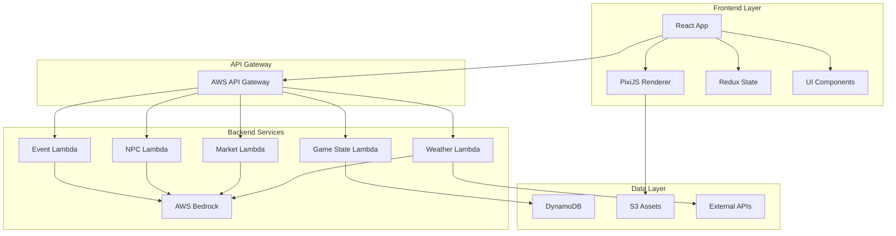

# Design Document

## Overview

Harvest Hope: The Last Farm is a web-based farming simulation game that combines retro 16-bit aesthetics with modern AI-powered systems to educate players about Indian agricultural challenges. The system architecture integrates a React/PixiJS frontend with AWS serverless backend services, utilizing AWS Bedrock for AI-generated content including weather predictions, market simulations, and NPC storytelling.

The game simulates realistic farming economics through property-based tested algorithms, ensuring mathematical accuracy in loan calculations, crop yields, and market dynamics. Players experience the full spectrum of farmer decision-making across 120-day seasonal cycles, learning about government schemes, financial literacy, and sustainable farming practices through engaging gameplay.

## Architecture

### High-Level Architecture



### Technology Stack

**Frontend:**
- React 18 with TypeScript for component-based UI
- PixiJS 8 for high-performance 2D rendering and pixel art
- Redux Toolkit for predictable state management
- Tailwind CSS for responsive UI styling
- Howler.js for 8-bit audio and spatial sound effects
- Vite for fast development and optimized builds

**Backend:**
- AWS Lambda (Python 3.11) for serverless compute
- AWS API Gateway for RESTful endpoints
- AWS DynamoDB for game state persistence
- AWS S3 for static assets (sprites, audio, data files)
- AWS Bedrock (Claude 3.5 Sonnet) for AI content generation
- AWS CloudWatch for monitoring and logging

**Testing:**
- Jest for unit testing
- React Testing Library for component testing
- fast-check for property-based testing
- Puppeteer for end-to-end testing

## Components and Interfaces

### Frontend Components

**GameEngine Component**
- Manages overall game loop and state transitions
- Coordinates between PixiJS renderer and React UI
- Handles user input and game events
- Manages save/load operations

**FarmRenderer Component**
- PixiJS-based farm visualization
- Renders crop growth stages with pixel art sprites
- Handles farm interaction (planting, harvesting)
- Applies retro visual effects (CRT shaders, scanlines)

**UIManager Component**
- HUD displaying money, day, season, weather
- Modal dialogs for events and decisions
- Government scheme encyclopedia
- Financial tracking dashboard

**NPCDialog Component**
- Contextual dialogue system
- Relationship tracking visualization
- Story progression indicators
- Educational content integration

### Backend Services

**WeatherService Lambda**
- Integrates with IMD historical data
- Generates realistic monsoon predictions using AI
- Calculates daily weather impacts on crops
- Triggers extreme weather events

**MarketService Lambda**
- Simulates crop prices based on supply/demand
- Integrates real MSP data from government sources
- Provides selling recommendations
- Handles government procurement scenarios

**NPCService Lambda**
- Generates unique farmer characters with AI
- Creates contextual dialogue based on game state
- Manages relationship dynamics
- Tracks story outcomes and consequences

**EventService Lambda**
- Generates random events based on current conditions
- Provides multiple choice scenarios
- Calculates event consequences
- Maintains educational context

**GameStateService Lambda**
- Handles save/load operations
- Manages player progression
- Tracks achievements and statistics
- Provides leaderboard functionality

### Data Interfaces

**GameState Interface**
```typescript
interface GameState {
  player: PlayerProfile;
  farm: FarmData;
  economics: EconomicsData;
  season: SeasonData;
  weather: WeatherData;
  npcs: NPCData[];
  stats: StatisticsData;
  progress: ProgressData;
}
```

**API Endpoints**
- `POST /weather/predict` - Generate monsoon predictions
- `POST /market/simulate` - Calculate current crop prices
- `POST /npc/generate` - Create new farmer characters
- `POST /events/generate` - Create random events
- `GET/POST /gamestate/{playerId}` - Save/load game state

## Data Models

### Core Game Entities

**Farm Model**
- Land area and soil characteristics
- Crop tracking with growth stages
- Livestock management
- Equipment and infrastructure
- Water and irrigation systems

**Economics Model**
- Bank account and cash flow
- Loan tracking with EMI calculations
- Income and expense categorization
- Government scheme benefits
- Credit score and debt management

**Weather Model**
- Seasonal predictions with uncertainty
- Daily weather generation
- Extreme event modeling
- Impact calculations on crops

**NPC Model**
- Personal demographics and background
- Current crisis and emotional state
- Dialogue trees and relationship tracking
- Story arc progression
- Educational value mapping

### Data Persistence Schema

**DynamoDB Tables:**
- `GameStates` - Player save data with TTL
- `NPCTemplates` - Pre-generated character archetypes
- `MarketData` - Historical price data cache
- `PlayerStats` - Aggregated gameplay statistics

**S3 Buckets:**
- `harvest-hope-assets` - Sprite sheets and audio files
- `harvest-hope-data` - IMD weather data and MSP rates
- `harvest-hope-configs` - Game balance parameters

## Correctness Properties

*A property is a characteristic or behavior that should hold true across all valid executions of a system-essentially, a formal statement about what the system should do. Properties serve as the bridge between human-readable specifications and machine-verifiable correctness guarantees.*
### Property Reflection

After reviewing all properties identified in the prework, several areas of redundancy and consolidation opportunities were identified:

**Redundancy Elimination:**
- Properties 2.4 and 2.5 (drought/flood impacts) can be combined into a single weather impact property
- Properties 3.1 and 3.4 (market price generation and advice) can be consolidated into comprehensive market behavior
- Properties 5.2, 5.3, and 5.5 (NPC dialogue, crisis handling, story outcomes) overlap and can be unified
- Properties 6.1, 6.2, and 6.5 (scheme presentation, eligibility, education) can be combined into scheme integration
- Properties 8.1, 8.2, and 8.4 (event generation, choices, education) can be consolidated into event system behavior

**Unique Properties Retained:**
- EMI calculation accuracy (4.3) - Critical financial correctness
- Save/load round trip (10.2) - Data integrity essential
- Seasonal cycle progression (1.2, 1.5) - Core game loop
- Crop growth tracking (1.3, 1.4) - Agricultural simulation core
- Weather prediction bounds (2.1) - AI system correctness

Property 1: Seasonal cycle consistency
*For any* game state, each season should provide exactly 120 days and advance to the correct next season in the cycle (Kharif → Rabi → Zaid → Off-season → Kharif)
**Validates: Requirements 1.2, 1.5**

Property 2: Crop growth progression
*For any* planted crop, growth stages should progress monotonically from seedling to harvestable, with yield calculations staying within biological limits for that crop type
**Validates: Requirements 1.3, 1.4**

Property 3: Weather impact consistency
*For any* weather conditions (drought, flood, normal), crop yields and costs should be affected proportionally, with extreme conditions having greater impact than moderate conditions
**Validates: Requirements 2.2, 2.4, 2.5**

Property 4: Weather prediction bounds
*For any* generated monsoon prediction, rainfall amounts should fall within historical ranges for the region, and drought/flood risks should be mutually exclusive at extreme levels
**Validates: Requirements 2.1**

Property 5: Market price realism
*For any* crop and market conditions, simulated prices should stay within realistic bounds (never below 50% MSP due to government procurement, rarely above 200% MSP except in extreme shortages)
**Validates: Requirements 3.1, 3.2**

Property 6: EMI calculation accuracy
*For any* loan parameters (principal, interest rate, duration), EMI calculations should be mathematically correct, with total payments exceeding principal by the expected interest amount
**Validates: Requirements 4.3**

Property 7: Financial transaction integrity
*For any* financial transaction (crop sales, loan payments, expenses), the player's money balance should be updated correctly and all transactions should be recorded
**Validates: Requirements 3.3, 4.4**

Property 8: NPC interaction consistency
*For any* generated NPC, their dialogue and available interactions should match their current crisis level and relationship with the player
**Validates: Requirements 5.1, 5.2, 5.4**

Property 9: Government scheme integration
*For any* eligible situation, relevant government schemes should be presented to the player with accurate information and proper benefit application
**Validates: Requirements 6.1, 6.2, 6.3**

Property 10: Event system coherence
*For any* generated event, the choices presented should be contextually appropriate to current farm/market conditions, and consequences should affect game state as described
**Validates: Requirements 8.1, 8.2, 8.3**

Property 11: Save/load round trip
*For any* game state, saving and then loading should restore the exact same state with no data loss or corruption
**Validates: Requirements 10.1, 10.2**

## Error Handling

### Frontend Error Handling
- Network connectivity issues with graceful degradation
- Invalid user input validation and feedback
- Asset loading failures with fallback resources
- State corruption detection and recovery
- Performance monitoring and optimization

### Backend Error Handling
- AI service timeout and fallback responses
- Database connection failures with retry logic
- Invalid game state validation and correction
- Rate limiting and abuse prevention
- Comprehensive logging for debugging

### Data Validation
- Input sanitization for all user data
- Game state consistency checks
- Financial calculation verification
- Weather data bounds checking
- NPC generation validation

## Testing Strategy

### Dual Testing Approach

The system employs both unit testing and property-based testing to ensure comprehensive correctness:

**Unit Testing:**
- Specific examples demonstrating correct behavior
- Edge cases and boundary conditions
- Integration points between components
- Error handling scenarios
- UI component functionality

**Property-Based Testing:**
- Universal properties verified across all inputs using fast-check library
- Minimum 100 iterations per property test
- Each property test tagged with format: **Feature: harvest-hope, Property {number}: {property_text}**
- Mathematical correctness for financial calculations
- Game logic consistency across all scenarios
- AI-generated content validation

### Testing Framework Configuration

**Property-Based Testing Library:** fast-check for JavaScript/TypeScript
- Configured for minimum 100 test iterations per property
- Custom generators for game-specific data types
- Shrinking enabled for minimal failing examples
- Deterministic seeding for reproducible tests

**Unit Testing Framework:** Jest with React Testing Library
- Component testing for UI interactions
- Service layer testing for business logic
- Mock implementations for external dependencies
- Coverage reporting and thresholds

### Test Categories

**Core Game Logic Tests:**
- EMI calculation accuracy across all loan parameters
- Crop yield calculations within biological bounds
- Weather prediction meteorological consistency
- Market price economic bounds and relationships
- Save/load data integrity verification

**AI Integration Tests:**
- Weather prediction API response validation
- NPC generation content quality checks
- Market simulation realistic output verification
- Event generation contextual appropriateness

**User Interface Tests:**
- Component rendering and interaction
- State management and updates
- Error handling and user feedback
- Accessibility and responsive design

**End-to-End Tests:**
- Complete gameplay scenarios
- Multi-season progression
- Financial decision consequences
- Educational content delivery

Each property-based test must be tagged with the exact format: **Feature: harvest-hope, Property {number}: {property_text}** to link back to the design document properties.